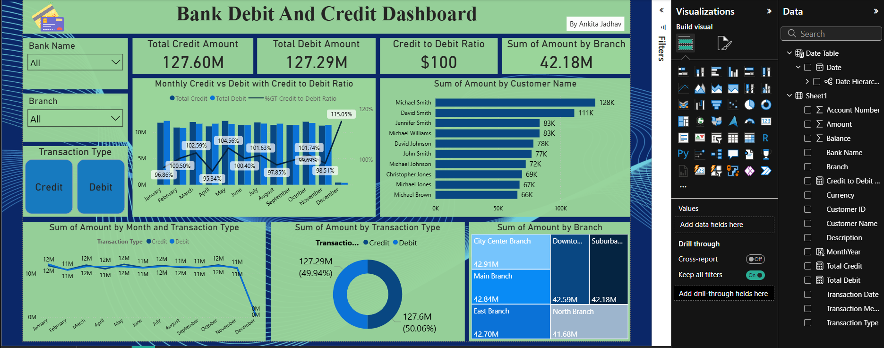

# 🏦 Banking Transaction Analytics Dashboard

## Overview
Analyzed 100,000+ banking transaction records to identify spending patterns, 
branch performance, and transaction method distribution across 6 major Indian banks.

## Tools Used
- Microsoft Excel (Pivot Tables, Charts, Slicers, Dashboard)

## Dataset
- 100,000+ transaction records
- Fields: Transaction Date, Type (Credit/Debit), Amount, Balance, 
  Description, Branch, Transaction Method, Bank Name

## Key Findings
- Suburban Branch processed the highest total transaction volume
- Transaction methods (Bank Transfer, Credit Card, Debit Card) are 
  distributed almost equally at ~33% each
- December showed a significant drop in transaction volume — 
  possible seasonal or data collection factor worth investigating
- Bonus Payments and Refunds from Retailers were the top transaction categories

## Dashboard Preview

                      (Banking-Analytics/Screenshot 2026-04-29 174747.png)
![Excel Dashboards]   (Banking-Analytics/Screenshot 2026-04-29 174836.png)
                      (Banking-Analytics/Screenshot 2026-04-29 175355.png)
## 🔗 Live Dashboard
[View on Tableau Public](https://public.tableau.com/app/profile/ankita.jadhav6953/viz/Credit-debitdashboard/Dashboard1?publish=yes)                      
                      
                      
## Skills Demonstrated
- Data cleaning and transformation in Excel
- Pivot table creation and analysis
- Interactive dashboard design with slicers
- KPI identification and visualization
